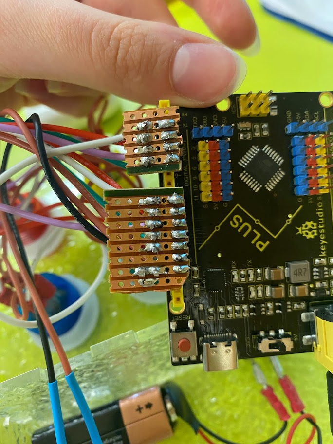
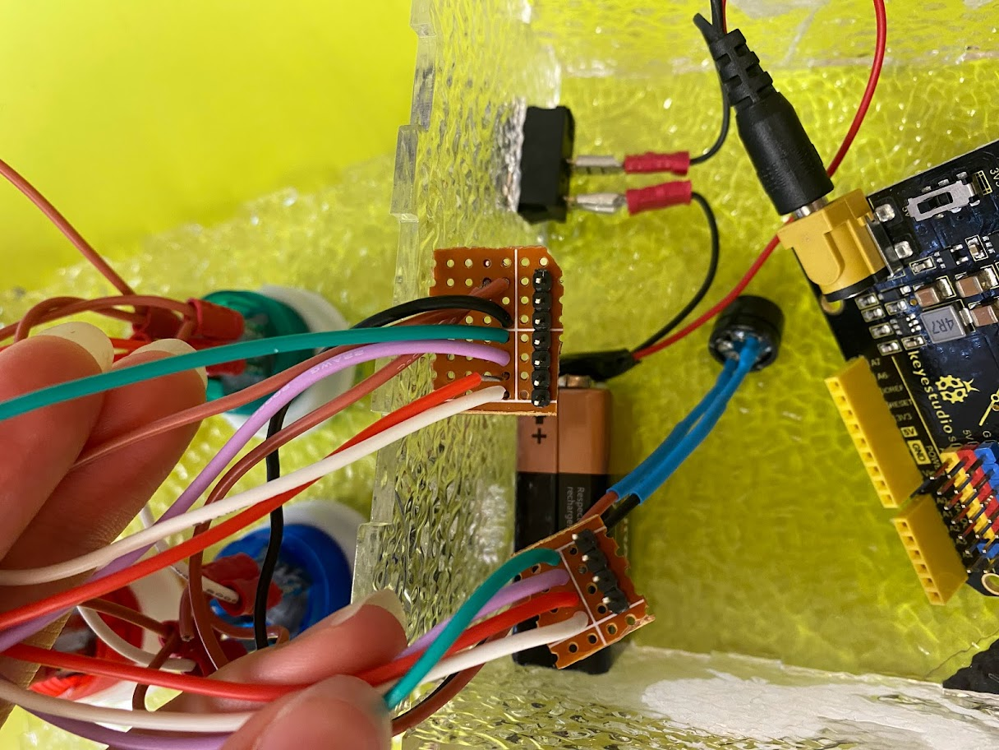
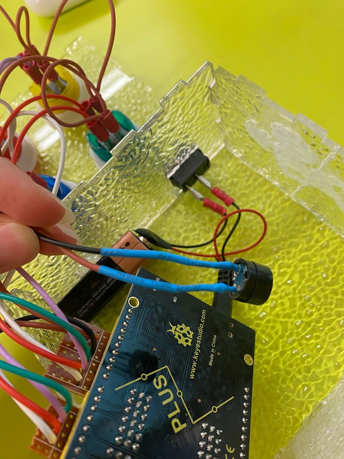
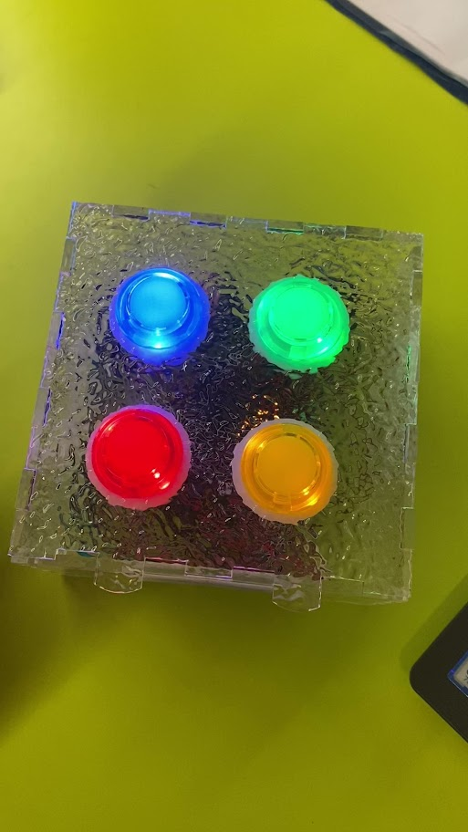

# SimonSays

**Katla rún Arnórsdóttir**
tangir,víra, eg lóðaði,setti kóða í arduino, lóðaði saman vira og við bretti sem tengdist í arduinoið.

<!--
## kóði
 [kóði](Efni_simon.ino%20at%20main%20%C2%B7%20VESM1VS_Efni%20%C2%B7%20GitHub%20(k%C3%B3%C3%B0i).html) -->

## spilun af spili
[vidjó](https://photos.google.com/photo/AF1QipOaH96-VA7S2TiINfuIr1qwAGSlPDApt0xxw0U)

## Myndir af lóðningum

## Mynd af snúrum

## Mynd af tökkum

## Mynd af teikningu af kassa

[def]: ./IMG_2107.jpg